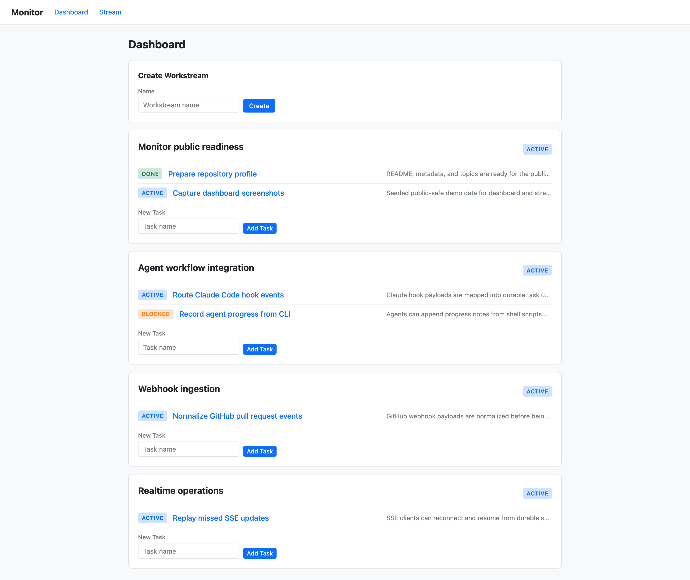
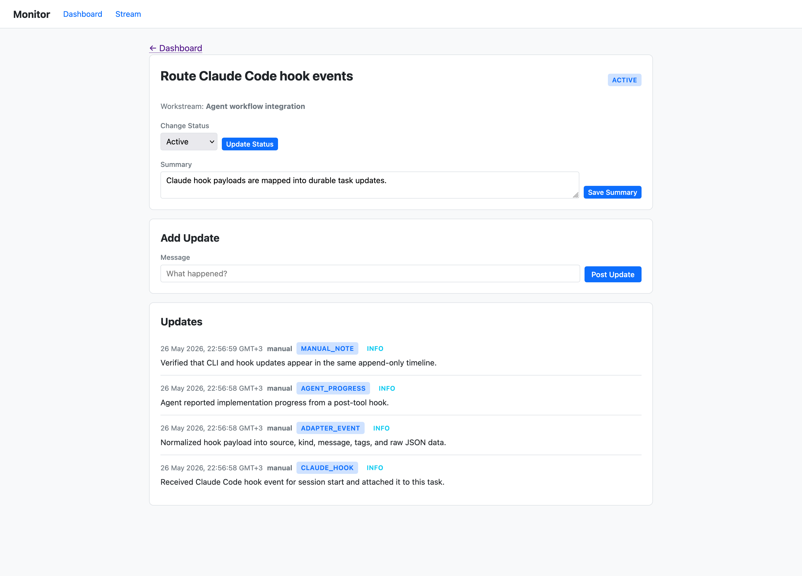
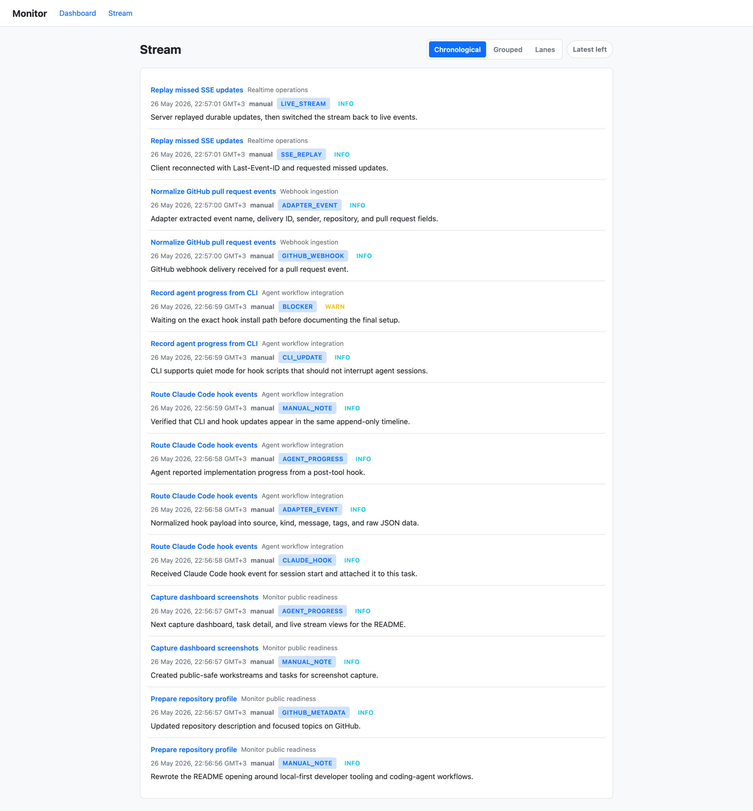
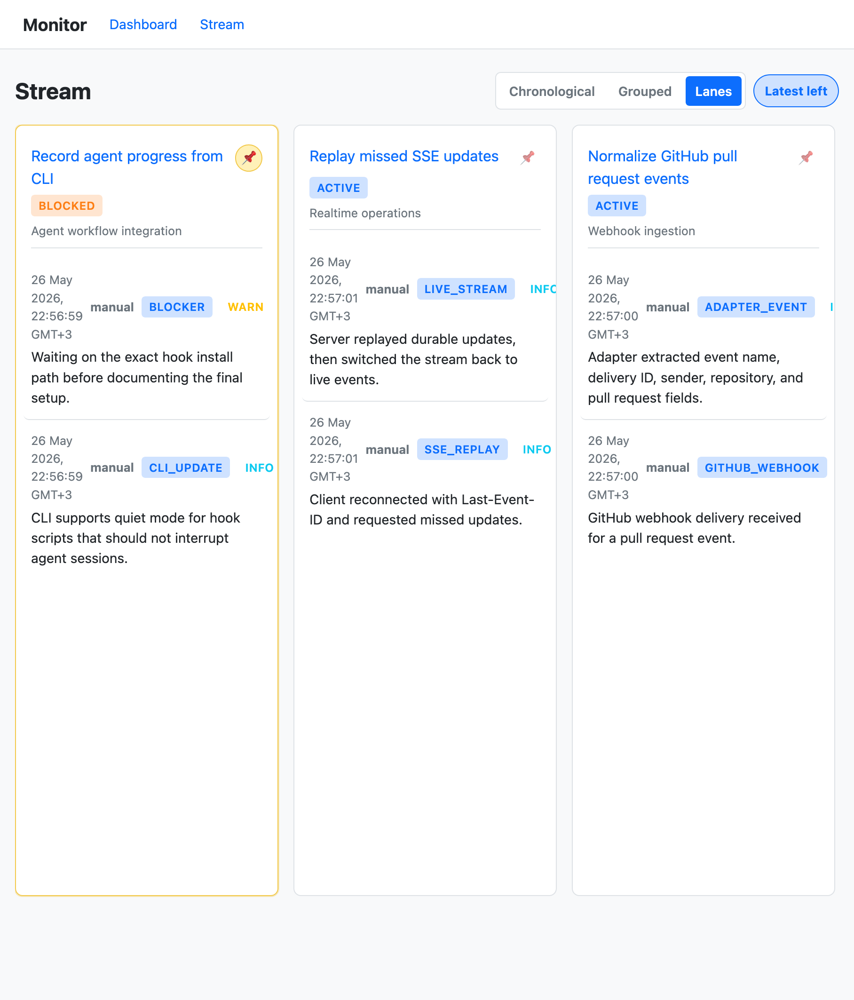

# Monitor

[](https://github.com/amitkot/monitor/actions/workflows/ci.yml)

Local-first task monitoring for development work, humans, and coding agents.

Monitor aggregates updates from humans, Claude Code hooks, GitHub webhooks, and CLI/API clients into a task-centric dashboard and API. It stores durable state in SQLite, exposes REST and SSE endpoints, serves a lightweight web UI, and includes a Rust CLI for scripting and automation.

This project explores how engineering teams can track work across humans, coding agents, CI systems, and external tools without depending on a remote SaaS workflow system.

## Status

Early development. The core data model, REST API, SQLite storage, SSE streaming, CLI, and basic web UI are functional. APIs may still change.

## Highlights

- Rust workspace with separate common, server, and CLI crates
- Axum server with REST API, SSE streaming, and bearer-token auth
- SQLite persistence using `sqlx`
- Append-only task updates with durable sequence IDs for replay/resume
- Local-first workflow with optional strict auth for deployment
- Source adapters for manual updates, Claude Code hooks, and GitHub webhooks
- Lightweight web UI using Askama templates
- CLI designed for scripts, hooks, and agent workflows

## Architecture

```text
CLI / Hooks / GitHub Webhooks / Manual Updates
                    |
                    v
              Monitor Server
          Axum + Services + Auth
                    |
                    v
                 SQLite
                    |
                    v
        REST API + SSE + Web Dashboard
```

Monitor uses an append-only update model. External sources submit updates, the server stores them durably in SQLite, and clients consume current state through REST, live updates through SSE, or the web dashboard.

## Workspace

- `crates/monitor-common`
  Shared domain types and API request/response structs.
- `crates/monitor-server`
  Axum server, SQLite storage, SSE, Askama web UI, and source adapters.
- `crates/monitor-cli`
  CLI for creating workstreams/tasks and sending manual updates.

## Requirements

- Rust toolchain with `cargo`
- SQLite support is bundled through `sqlx`/`libsqlite3-sys`
- a browser if you want to use the web UI

## Quick Start

Start the server:

```bash
cargo run -p monitor-server
```

By default it listens on `http://127.0.0.1:3000` and creates `monitor.db` in the repo root.

Install the CLI once:

```bash
cargo install --path crates/monitor-cli
```

Open the web UI:

```text
http://127.0.0.1:3000/dashboard
```

Open the global live feed:

```text
http://127.0.0.1:3000/stream
```

Create a workstream:

```bash
monitor-cli workstream create "Monitor MVP"
```

Create a task:

```bash
monitor-cli task create "SSE replay support" \
  --workstream <WORKSTREAM_ID>
```

Send a manual update:

```bash
monitor-cli update manual \
  --task <TASK_ID> \
  --message "Implemented initial SSE path" \
  --kind manual_note \
  --level info \
  --tags backend,sse
```

List tasks:

```bash
monitor-cli task list
```

## Example Use Cases

- Track progress of several coding agents working on independent tasks.
- Send updates from Claude Code hooks into a shared local dashboard.
- Attach GitHub webhook updates to a workstream.
- Use the CLI from scripts to append task updates.
- Watch task progress live through SSE or the web UI.

## Screenshots

### Dashboard



### Task Detail



### Live Stream



### Stream Lanes



## Configuration

The server reads configuration from environment variables:

- `MONITOR_BIND`
  Bind address. Default: `127.0.0.1:3000`
- `MONITOR_DB`
  SQLite URL. Default: `sqlite:monitor.db?mode=rwc`
- `MONITOR_AUTH_MODE`
  `relaxed` or `strict`
- `MONITOR_API_TOKENS`
  Comma-separated bearer tokens

Example:

```bash
export MONITOR_AUTH_MODE=strict
export MONITOR_API_TOKENS=dev-secret-token
cargo run -p monitor-server
```

Auth behavior:

- `relaxed`
  Read endpoints may be open. Write endpoints require a token if tokens are configured.
- `strict`
  Read and write endpoints require a token.
  If no tokens are configured in strict mode, the server fails closed on API requests.

For CLI usage against an authenticated server:

```bash
export MONITOR_TOKEN=dev-secret-token
monitor-cli workstream list
```

## CLI

Common commands:

```bash
# Workstreams
monitor-cli workstream create "My Workstream"
monitor-cli workstream list --include-archived
monitor-cli workstream update <WORKSTREAM_ID> --status archived

# Tasks
monitor-cli task create "My Task" --workstream <WORKSTREAM_ID>
monitor-cli task list --workstream <WORKSTREAM_ID>
monitor-cli task update <TASK_ID> --status blocked
monitor-cli task update <TASK_ID> --summary "Waiting on vendor response"

# Manual updates
monitor-cli update manual --task <TASK_ID> --message "Progress note"
```

The CLI prints JSON responses so it can be used in scripts.

Global output flags:

- `--quiet`, also available as `--silent`, suppresses all stdout/stderr output but preserves the normal exit status.

Claude hook style example:

```bash
monitor-cli --quiet update manual \
  --task <TASK_ID> \
  --message "Claude hook observed a session event" \
  --kind claude_hook \
  --tags claude,hook \
  || true
```

## API Overview

State endpoints:

- `POST /api/workstreams`
- `GET /api/workstreams`
- `PATCH /api/workstreams/:id`
- `POST /api/tasks`
- `GET /api/tasks`
- `PATCH /api/tasks/:id`
- `GET /api/updates`
- `GET /api/stream`

Ingest endpoints:

- `POST /api/updates/manual`
- `POST /api/updates/claude-hook`
- `POST /api/updates/github-webhook`

Useful query parameters:

- `GET /api/workstreams?include_archived=true`
- `GET /api/tasks?workstream_id=<UUID>&status=active`
- `GET /api/updates?task_id=<UUID>&kind=tool_use&limit=50`
- `GET /api/updates?tag=github&tag=completed`
  Repeated `tag` params are match-any.
- `GET /api/updates?after_seq=123`
- `GET /api/stream?task_id=<UUID>`

## SSE

`GET /api/stream` emits live events for task activity and state changes.

Behavior:

- task activity is emitted as `event: update`
- state changes are emitted as `task_created`, `task_updated`, `workstream_created`, and `workstream_updated`
- `update` events use `Update.seq` as the SSE event id
- `Last-Event-ID` is honored on reconnect
- `after_seq` is also supported as a query param

Simple curl example:

```bash
curl -N http://127.0.0.1:3000/api/stream
```

Authenticated example:

```bash
curl -N \
  -H "Authorization: Bearer $MONITOR_TOKEN" \
  http://127.0.0.1:3000/api/stream
```

## Testing

### Manual E2E Checklist

See [docs/e2e-checklist.md](docs/e2e-checklist.md) for the full end-to-end verification procedure.

### Automated Tests

Run the full workspace tests:

```bash
cargo test --workspace
```

Run server-only tests:

```bash
cargo test -p monitor-server --bin monitor-server
```

Useful subsets:

```bash
cargo test -p monitor-server auth_tests
cargo test -p monitor-server integration_tests
cargo test -p monitor-server smoke_test
```

Note:

- SSE and smoke tests bind a real loopback listener on `127.0.0.1:0`
- those tests must be run in a normal local environment where opening local sockets is allowed
- they will fail in restricted sandboxes that deny loopback binds

## Source Adapters

### Claude Code hooks

Send raw hook payloads to:

```text
POST /api/updates/claude-hook
```

The request must include:

- `task_id`
- `payload`

The hook caller is responsible for routing the event to the correct `task_id`.

### GitHub webhooks

Send raw GitHub webhook payloads to:

```text
POST /api/updates/github-webhook
```

The request must include:

- `task_id`
- `payload`
- optional selected headers such as `x-github-event` and `x-github-delivery`

## Project Status

This project is in early development. The core API and data model are functional but may change.

Design and implementation references:

- [docs/plans/monitor-system-design.md](docs/plans/monitor-system-design.md)
- [docs/plans/monitor-implementation-plan.md](docs/plans/monitor-implementation-plan.md)
- [ai_docs/source-event-shapes.md](ai_docs/source-event-shapes.md)

## License

This project is licensed under the [MIT License](LICENSE).
